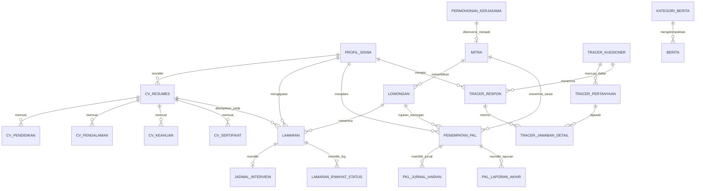

# Blueprint & Perancangan Skema Database BKK SMK Plus Pelita Nusantara

Dokumen arsitektur database relasional untuk **Sistem BKK (Bursa Kerja Khusus) SMK Plus Pelita Nusantara**, dirancang berdasarkan hasil penelusuran menyeluruh pada:
- **Dashboard Siswa & Alumni**: `resources/views/me`
- **Dashboard Mitra IDUKA**: `resources/views/mitra`
- **Dashboard Admin BKK**: `resources/views/admin`
- **Sitemap & Alur Rute**: `SITEMAP.md` & `routes/web.php`
- **Layanan Autentikasi Terpusat**: `VERIFY_MIDDLEWARE.md` & `VerifyAuthToken.php`
- **Migrasi & Model Existing**: `kategori_berita`, `berita`, `users`

---

## 1. Arsitektur Entitas & Strategi Autentikasi

```
+-----------------------------------------------------------------------------------+
|                        AUTH MICROSERVICE (PORT 3002)                              |
|  Tabel: users (UUID, username, role: ADMIN, GURU, TU, SISWA, KEPSEK, BK, dll)     |
+-----------------------------------------------------------------------------------+
                                         |
                       (Token Verification via Bearer/Cookie)
                                         v
+-----------------------------------------------------------------------------------+
|                          LARAVEL BKK DATABASE (LOCAL)                             |
|                                                                                   |
|  [Siswa / Alumni]                 [Mitra IDUKA]               [Admin BKK / Guru]  |
|  * profil_siswa (FK user_uuid)    * mitra (NPWP + Password)   * Relasi via        |
|  * cv_resumes & sub-tables        * Bypass VerifyMiddleware     user_uuid         |
|  * lamaran & jadwal_interview     * Auth lokal                * Kelola Berita,    |
|  * pkl_jurnal_harian              * Kelola Lowongan & Pelamar   Monitoring PKL,   |
|  * pkl_laporan_akhir                                            Tracer Study,     |
|  * tracer_respon (Multi Kuesioner)                              Validasi & Mitra  |
+-----------------------------------------------------------------------------------+
```

### Keputusan Kunci Arsitektur:
1. **Siswa, Alumni, Guru, dan Admin BKK**:
   - Autentikasi diverifikasi via REST API Microservice (`/api/user/verify`).
   - Identitas primer menggunakan **UUID (`user_id`)** dari Auth Service.
   - Pembeda antara Siswa Aktif dan Alumni disimpan di tabel lokal `profil_siswa.status_kelulusan` (`SISWA_AKTIF` / `ALUMNI`) dan angkatan/tahun lulus.
2. **Mitra IDUKA (Perusahaan Industri)**:
   - Sesuai dengan rute `/bkk/dashboard/*`, Mitra **membypass VerifyMiddleware**.
   - Mitra memiliki tabel mandiri `mitra` dengan kredensial login unik: **NPWP** dan **Password Hash**.
3. **Model CV ATS Hybrid**:
   - Tabel induk `cv_resumes` menyimpan ringkasan, skor AI, JSON parameter, dan raw Markdown teks.
   - Tabel anak (`cv_pendidikan`, `cv_pengalaman`, `cv_keahlian`, `cv_sertifikat`) menyimpan entri terstruktur agar sinkronisasi form dinamis dan pencarian bakat berjalan cepat dan terindeks.
4. **Tracer Study Dinamis (Multi-Kuesioner)**:
   - Menggunakan sistem bank survei (`tracer_kuesioner`, `tracer_pertanyaan`, `tracer_respon`, `tracer_jawaban_detail`) sehingga sekolah bebas membuat survei berkala (misal 6 bulan, 1 tahun, 2 tahun pasca lulus) yang diisi alumni di `/bkk/me`.

---

## 2. Diagram Hubungan Entitas (ERD)



---

## 3. Rincian Skema & Kamus Tabel Database

### Kelompok 1: Profil Siswa & Alumni (Lokal BKK)

#### 1. `profil_siswa`
Menyimpan atribut data akademik dan kesiswaan pelengkap yang tidak disediakan oleh Auth Service pusat.
- **`user_id`** (`UUID`, Primary Key, Indeks): Referensi langsung ke ID user pada Auth Service.
- **`nis`** (`VARCHAR(20)`, Indeks): Nomor Induk Siswa.
- **`nisn`** (`VARCHAR(20)`, Nullable, Indeks): Nomor Induk Siswa Nasional.
- **`jurusan`** (`VARCHAR(100)`): Misal: *Rekayasa Perangkat Lunak (RPL)*, *Teknik Komputer & Jaringan (TKJ)*, *Desain Komunikasi Visual (DKV)*, *Akuntansi & Keuangan Lembaga (AKL)*.
- **`kelas`** (`VARCHAR(50)`, Nullable): Misal: *XII RPL 1*, *XII TKJ 2*.
- **`angkatan`** (`YEAR` / `VARCHAR(10)`): Tahun masuk angkatan (misal: 2023).
- **`tahun_lulus`** (`YEAR`, Nullable): Tahun kelulusan sekolah (terisi jika alumni).
- **`status_kelulusan`** (`ENUM('SISWA_AKTIF', 'ALUMNI')`, Default: `SISWA_AKTIF`): Pembeda hak akses fitur siswa vs alumni.
- **`status_aktivitas`** (`VARCHAR(100)`, Nullable): Status saat ini (misal: *PKL di PT Telkom Akses*, *Mencari kerja full-time*, *Kuliah di Undip*).
- **`kelengkapan_profil`** (`TINYINT UNSIGNED`, Default: 0): Persentase skor kelengkapan data (0-100%).
- **`headline_profesi`** (`VARCHAR(150)`, Nullable): Headline singkat profil (misal: *Junior Web Developer | SMK Penus*).
- **`bio_singkat`** (`TEXT`, Nullable): Deskripsi diri ringkas.
- **`link_linkedin`** (`VARCHAR(255)`, Nullable): Tautan akun LinkedIn.
- **`link_github`** (`VARCHAR(255)`, Nullable): Tautan repositori GitHub.
- **`link_portfolio`** (`VARCHAR(255)`, Nullable): Tautan situs portofolio pribadi.
- **`created_at`, `updated_at`** (`TIMESTAMP`).

---

### Kelompok 2: Modul CV ATS & AI Engine (`/bkk/me/cv`)

#### 2. `cv_resumes`
Tabel master resume ATS siswa/alumni beserta metadata scoring dan hasil analisis AI.
- **`id`** (`BIGINT UNSIGNED`, Primary Key, Auto Increment).
- **`siswa_id`** (`UUID`, Indeks): Relasi ke `profil_siswa.user_id`.
- **`judul_cv`** (`VARCHAR(150)`, Default: `'CV Utama ATS'`): Nama label versi CV.
- **`is_primary`** (`BOOLEAN`, Default: `true`): Penanda apakah ini CV aktif untuk melamar.
- **`target_posisi`** (`VARCHAR(150)`, Nullable): Posisi yang dibidik (misal: *Teknisi Jaringan & Fiber Optic*).
- **`domisili_kota`** (`VARCHAR(100)`, Nullable): Kota tempat tinggal (misal: *Semarang* / *Bogor*).
- **`ringkasan_eksekutif`** (`TEXT`, Nullable): Ringkasan profil profesional.
- **`konten_markdown`** (`LONGTEXT`): Kode sumber Markdown CV lengkap yang disinkronkan dengan live preview dan editor.
- **`skor_total_ai`** (`TINYINT UNSIGNED`, Default: 0): Health score CV akumulasi (0-100).
- **`skor_parameter_json`** (`JSON`, Nullable): Rincian 4 parameter penilaian AI:
  ```json
  [
    {"label": "Kesesuaian Industri", "value": 88},
    {"label": "Kelengkapan Data", "value": 78},
    {"label": "Format ATS", "value": 92},
    {"label": "Daya Tarik Portofolio", "value": 80}
  ]
  ```
- **`saran_perbaikan_ai_json`** (`JSON`, Nullable): Daftar rekomendasi improvisasi AI:
  ```json
  [
    {
      "id": "s1",
      "section": "Portofolio & Sertifikat",
      "impact": "Tinggi",
      "title": "Tambahkan sertifikasi kejuruan BNSP / MTCNA",
      "desc": "Cantumkan sertifikat keahlian MikroTik (MTCNA)..."
    }
  ]
  ```
- **`terakhir_dianalisis_ai`** (`TIMESTAMP`, Nullable): Waktu terakhir evaluasi AI dijalankan.
- **`created_at`, `updated_at`** (`TIMESTAMP`).

#### 3. `cv_pendidikan`
Riwayat pendidikan terstruktur untuk form builder CV.
- **`id`** (`BIGINT UNSIGNED`, PK).
- **`cv_id`** (`BIGINT UNSIGNED`, FK ke `cv_resumes.id`, On Delete Cascade).
- **`nama_institusi`** (`VARCHAR(150)`): Misal: *SMK Plus Pelita Nusantara*.
- **`jurusan_peminatan`** (`VARCHAR(150)`): Misal: *Teknik Komputer & Jaringan*.
- **`tahun_mulai`** (`VARCHAR(10)`): Misal: *2022*.
- **`tahun_selesai`** (`VARCHAR(10)`): Misal: *2025* atau *Sekarang*.
- **`nilai_akhir`** (`VARCHAR(50)`, Nullable): Misal: *Rata-rata 88.4 / 100*.
- **`deskripsi_prestasi`** (`TEXT`, Nullable): Poin ekstrakurikuler/lomba kejuruan (LKS).
- **`urutan`** (`TINYINT UNSIGNED`, Default: 1).

#### 4. `cv_pengalaman`
Riwayat PKL, kerja magang, part-time, atau freelance.
- **`id`** (`BIGINT UNSIGNED`, PK).
- **`cv_id`** (`BIGINT UNSIGNED`, FK ke `cv_resumes.id`, On Delete Cascade).
- **`tipe_pengalaman`** (`ENUM('PKL', 'KERJA', 'MAGANG', 'FREELANCE', 'PROYEK')`, Default: `'PKL'`).
- **`posisi`** (`VARCHAR(150)`): Misal: *Field Technician Apprentice*.
- **`perusahaan`** (`VARCHAR(150)`): Misal: *PT Telkom Akses Semarang*.
- **`lokasi`** (`VARCHAR(100)`, Nullable): Misal: *Semarang*.
- **`periode_mulai`** (`DATE` / `VARCHAR(20)`).
- **`periode_selesai`** (`DATE` / `VARCHAR(20)`, Nullable).
- **`is_current`** (`BOOLEAN`, Default: `false`).
- **`deskripsi_tugas`** (`TEXT`): Kalimat penjelasan tugas yang sudah diimprovisasi dengan action verb.
- **`urutan`** (`TINYINT UNSIGNED`, Default: 1).

#### 5. `cv_keahlian`
Daftar kompetensi teknis dan soft skills.
- **`id`** (`BIGINT UNSIGNED`, PK).
- **`cv_id`** (`BIGINT UNSIGNED`, FK ke `cv_resumes.id`, On Delete Cascade).
- **`nama_keahlian`** (`VARCHAR(100)`): Misal: *Fiber Optic Splicing*, *MikroTik MTCNA*, *Laravel*, *Accurate 5*.
- **`kategori`** (`VARCHAR(50)`, Default: `'Teknis'`): Kategori keahlian (Networking, Programming, Finance, Design, Tools).
- **`tingkat_kemahiran`** (`ENUM('Dasar', 'Menengah', 'Mahir')`, Nullable).

#### 6. `cv_sertifikat`
Portofolio, sertifikat kompetensi LSP/BNSP, dan piagam kejuaraan.
- **`id`** (`BIGINT UNSIGNED`, PK).
- **`cv_id`** (`BIGINT UNSIGNED`, FK ke `cv_resumes.id`, On Delete Cascade).
- **`nama_sertifikat`** (`VARCHAR(200)`): Misal: *Sertifikasi Kompetensi Kejuruan TKJ LSP-P1*.
- **`lembaga_penerbit`** (`VARCHAR(150)`): Misal: *BNSP / MikroTik Academy*.
- **`tahun_perolehan`** (`VARCHAR(10)`).
- **`nomor_sertifikat`** (`VARCHAR(100)`, Nullable).
- **`file_url`** (`TEXT`, Nullable): Path dokumen upload (PDF/JPG) untuk verifikasi tim BKK.
- **`status_verifikasi`** (`ENUM('MENUNGGU', 'VALID', 'TIDAK_VALID')`, Default: `'MENUNGGU'`).

---

### Kelompok 3: Mitra IDUKA & Pengajuan Kerja Sama (`/bkk/mitra` & `/bkk/kerja-sama`)

#### 7. `mitra`
Tabel akun dan profil perusahaan industri IDUKA yang telah terafiliasi dengan sekolah.
- **`id`** (`BIGINT UNSIGNED`, PK, Auto Increment).
- **`nama_perusahaan`** (`VARCHAR(200)`, Indeks): Misal: *PT Solusi Teknologi Nusantara*.
- **`singkatan`** (`VARCHAR(50)`, Nullable): Misal: *STN*.
- **`npwp`** (`VARCHAR(50)`, Unique, Indeks): Nomor Pokok Wajib Pajak (digunakan sebagai **username login Mitra**).
- **`password`** (`VARCHAR(255)`): Password hash bcrypt untuk otentikasi login dashboard mitra.
- **`sektor_industri`** (`VARCHAR(150)`): Misal: *Teknologi Informasi, Rekayasa Perangkat Lunak & Jaringan*.
- **`alamat_kantor`** (`TEXT`): Lokasi fisik perusahaan.
- **`kota`** (`VARCHAR(100)`): Kota domisili kantor.
- **`website`** (`VARCHAR(255)`, Nullable): URL official portal.
- **`email_perusahaan`** (`VARCHAR(150)`): Email resmi kantor/HR.
- **`no_telp_perusahaan`** (`VARCHAR(50)`): Nomor kontak kantor.
- **`logo_url`** (`TEXT`, Nullable): Path avatar logo industri.
- **`status_kemitraan`** (`VARCHAR(100)`, Default: `'Mitra IDUKA Terverifikasi'`): Deskripsi status MoU.
- **`tanggal_mou_mulai`** (`DATE`, Nullable).
- **`tanggal_mou_selesai`** (`DATE`, Nullable).
- **`is_verified`** (`BOOLEAN`, Default: `false`, Indeks): Status persetujuan dari Admin BKK.
- **`pic_name`** (`VARCHAR(150)`): Nama Person-in-Charge / HRD (misal: *Cindy Claudia, S.Kom.*).
- **`pic_role`** (`VARCHAR(150)`): Jabatan PIC (misal: *Lead Talent Acquisition*).
- **`pic_email`** (`VARCHAR(150)`): Email kontak PIC.
- **`pic_phone`** (`VARCHAR(50)`): Nomor WhatsApp aktif PIC.
- **`remember_token`** (`VARCHAR(100)`, Nullable).
- **`created_at`, `updated_at`** (`TIMESTAMP`).

#### 8. `permohonan_kerjasama`
Menampung formulir publik pengajuan MoU kemitraan industri dari laman `/bkk/kerja-sama`.
- **`id`** (`BIGINT UNSIGNED`, PK).
- **`nama_perusahaan`** (`VARCHAR(200)`).
- **`bidang_usaha`** (`VARCHAR(150)`).
- **`alamat_perusahaan`** (`TEXT`).
- **`email_resmi`** (`VARCHAR(150)`).
- **`no_telepon`** (`VARCHAR(50)`).
- **`nama_pic`** (`VARCHAR(150)`).
- **`jabatan_pic`** (`VARCHAR(150)`).
- **`jenis_kerjasama`** (`JSON`): Array jenis kemitraan yang diajukan (misal: `["PKL", "Rekrutmen Lulusan", "Guru Tamu", "Uji Kompetensi Keahlian"]`).
- **`pesan_tambahan`** (`TEXT`, Nullable).
- **`file_draft_mou`** (`TEXT`, Nullable): Lampiran proposal/draf kerja sama.
- **`status`** (`ENUM('MENUNGGU_REVIEW', 'DISETUJUI', 'DITOLAK')`, Default: `'MENUNGGU_REVIEW'`).
- **`catatan_admin`** (`TEXT`, Nullable).
- **`diproses_oleh`** (`UUID`, Nullable): ID Admin BKK yang memverifikasi.
- **`created_at`, `updated_at`** (`TIMESTAMP`).

---

### Kelompok 4: Lowongan Kerja, PKL, & Rekrutmen Pelamar

#### 9. `lowongan`
Daftar kesempatan PKL dan penyerapan kerja lulusan yang diterbitkan oleh Mitra IDUKA.
- **`id`** (`BIGINT UNSIGNED`, PK).
- **`mitra_id`** (`BIGINT UNSIGNED`, FK ke `mitra.id`, On Delete Cascade).
- **`judul`** (`VARCHAR(255)`, Indeks): Misal: *Junior Frontend Developer (Tailwind & React)*.
- **`slug`** (`VARCHAR(255)`, Unique, Indeks).
- **`tipe`** (`ENUM('PKL', 'Kerja')`, Indeks): Pembeda apakah magang siswa atau kerja lulusan.
- **`tipe_badge`** (`VARCHAR(50)`): Label badge UI (misal: *Full-Time Lulusan*, *Magang / PKL*).
- **`target_jurusan`** (`VARCHAR(150)`): Jurusan sasaran (misal: *RPL*, *TKJ*, *DKV*, *Semua Jurusan*).
- **`lokasi`** (`VARCHAR(150)`): Lokasi kerja (misal: *Bogor (Hybrid)*, *Semarang*).
- **`kategori_posisi`** (`VARCHAR(100)`, Nullable): Misal: *Software Engineering*, *Networking & IT Ops*.
- **`gaji_kompensasi`** (`VARCHAR(150)`, Nullable): Penjelasan gaji (misal: *Rp 4.500.000 - Rp 6.000.000* atau *Uang Saku Harian*).
- **`kuota`** (`SMALLINT UNSIGNED`, Default: 1): Jumlah penerimaan siswa/alumni.
- **`deadline`** (`DATE`, Indeks): Batas akhir pengajuan berkas.
- **`deskripsi`** (`TEXT`): Deskripsi komprehensif tanggung jawab pekerjaan.
- **`persyaratan_json`** (`JSON`): Poin-poin kualifikasi pelamar (array strings).
- **`benefit_json`** (`JSON`, Nullable): Fasilitas dan keuntungan yang ditawarkan (array strings).
- **`status`** (`ENUM('Aktif', 'Ditutup', 'Draft')`, Default: `'Aktif'`, Indeks).
- **`views_count`** (`BIGINT UNSIGNED`, Default: 0).
- **`created_at`, `updated_at`** (`TIMESTAMP`).

#### 10. `lamaran`
Menghubungkan siswa/alumni dengan lowongan yang dilamar, mencatat tahapan seleksi real-time.
- **`id`** (`BIGINT UNSIGNED`, PK).
- **`kode_lamaran`** (`VARCHAR(50)`, Unique, Indeks): Kode registrasi unik (misal: *LMR-2025-001*).
- **`lowongan_id`** (`BIGINT UNSIGNED`, FK ke `lowongan.id`, On Delete Cascade).
- **`siswa_id`** (`UUID`, Indeks): Relasi ke `profil_siswa.user_id`.
- **`cv_id`** (`BIGINT UNSIGNED`, FK ke `cv_resumes.id`): Snapshot CV yang diajukan saat melamar.
- **`tanggal_melamar`** (`DATE`, Indeks).
- **`skor_match_ai`** (`TINYINT UNSIGNED`, Default: 0): Kecocokan kualifikasi pelamar terhadap syarat lowongan (0-100%).
- **`status`** (`ENUM('Terkirim', 'Sedang Ditinjau', 'Dipanggil Interview', 'Diterima', 'Ditolak')`, Default: `'Terkirim'`, Indeks): Status seleksi yang dapat diupdate Mitra & Admin.
- **`step_tahapan`** (`TINYINT UNSIGNED`, Default: 1): Indikator progress visual (Step 1 s/d 4).
- **`catatan_seleksi`** (`TEXT`, Nullable): Catatan internal/feedback HRD industri kepada pelamar.
- **`created_at`, `updated_at`** (`TIMESTAMP`).

#### 11. `jadwal_interview`
Informasi teknis panggilan wawancara yang ditentukan oleh HRD Mitra untuk pelamar berstatus *Dipanggil Interview*.
- **`id`** (`BIGINT UNSIGNED`, PK).
- **`lamaran_id`** (`BIGINT UNSIGNED`, Unique, FK ke `lamaran.id`, On Delete Cascade).
- **`tanggal_interview`** (`DATE`).
- **`waktu_interview`** (`TIME` / `VARCHAR(20)`): Misal: *09:00 WIB*.
- **`mode`** (`ENUM('Tatap Muka (Offline)', 'Online (Zoom Meeting)', 'Online (Google Meet)')`, Default: `'Tatap Muka (Offline)'`).
- **`lokasi_atau_url`** (`TEXT`): Alamat fisik ruangan kantor atau tautan meeting online beserta passcode.
- **`pic_pewawancara`** (`VARCHAR(150)`): Nama kontak HRD / User penguji.
- **`instruksi_khusus`** (`TEXT`, Nullable): Petunjuk berpakaian, berkas cetak yang harus dibawa, dll.
- **`status_kehadiran`** (`ENUM('TERJADWAL', 'HADIR', 'RESCHEDULE', 'BATAL')`, Default: `'TERJADWAL'`).
- **`created_at`, `updated_at`** (`TIMESTAMP`).

#### 12. `lamaran_riwayat_status`
Audit trail log riwayat pergantian status lamaran untuk timeline visual pelamar.
- **`id`** (`BIGINT UNSIGNED`, PK).
- **`lamaran_id`** (`BIGINT UNSIGNED`, FK ke `lamaran.id`, On Delete Cascade).
- **`judul_tahapan`** (`VARCHAR(100)`): Misal: *Lamaran Terkirim*, *Review Tim HR*, *Panggilan Interview*, *Offering & Diterima*.
- **`deskripsi`** (`TEXT`, Nullable).
- **`diubah_oleh_id`** (`VARCHAR(100)`, Nullable): ID user penanggung jawab perubahan.
- **`diubah_oleh_role`** (`VARCHAR(50)`, Nullable): Role (`MITRA` / `ADMIN`).
- **`created_at`** (`TIMESTAMP`).

---

### Kelompok 5: Monitoring PKL Siswa, Jurnal & Laporan (`/bkk/me/jurnal`, `/bkk/me/laporan`, `/bkk/dashboard/pkl/*`)

#### 13. `penempatan_pkl`
Menghubungkan siswa aktif dengan institusi mitra industri tempat pelaksanaan PKL, serta menunjuk guru pembimbing sekolah.
- **`id`** (`BIGINT UNSIGNED`, PK).
- **`siswa_id`** (`UUID`, Indeks): Relasi ke `profil_siswa.user_id`.
- **`mitra_id`** (`BIGINT UNSIGNED`, FK ke `mitra.id`).
- **`lowongan_id`** (`BIGINT UNSIGNED`, Nullable, FK ke `lowongan.id`): Terisi jika penempatan bermula dari lowongan PKL di BKK.
- **`guru_pembimbing_id`** (`UUID`, Indeks): UUID Guru dari Auth Service yang bertugas membimbing dan memvalidasi.
- **`pembimbing_industri_nama`** (`VARCHAR(150)`, Nullable): Nama teknisi/mentor dari mitra (misal: *Bpk. Agus S.*).
- **`unit_kerja_divisi`** (`VARCHAR(150)`, Nullable): Divisi penempatan (misal: *Witel Semarang / Network Ops*).
- **`tanggal_mulai`** (`DATE`).
- **`tanggal_selesai`** (`DATE`).
- **`target_jam`** (`SMALLINT UNSIGNED`, Default: 640): Target standar akumulasi jam PKL SMK.
- **`total_jam_tercapai`** (`SMALLINT UNSIGNED`, Default: 0): Total jam jurnal yang telah disetujui.
- **`status`** (`ENUM('BERJALAN', 'SELESAI', 'DIBATALKAN', 'MENUNGGU_SURAT')`, Default: `'BERJALAN'`, Indeks).
- **`nilai_akhir_industri`** (`DECIMAL(5,2)`, Nullable): Nilai akhir kinerja PKL dari mitra (0-100).
- **`nilai_akhir_sekolah`** (`DECIMAL(5,2)`, Nullable): Nilai laporan akhir dari guru pembimbing.
- **`created_at`, `updated_at`** (`TIMESTAMP`).

#### 14. `pkl_jurnal_harian`
Pencatatan log aktivitas harian PKL yang diinput siswa di `/bkk/me/jurnal`.
- **`id`** (`BIGINT UNSIGNED`, PK).
- **`penempatan_pkl_id`** (`BIGINT UNSIGNED`, FK ke `penempatan_pkl.id`, On Delete Cascade).
- **`siswa_id`** (`UUID`, Indeks).
- **`tanggal`** (`DATE`, Indeks): Tanggal pelaksanaan kegiatan.
- **`aktivitas`** (`TEXT`): Deskripsi kegiatan teknis (dapat dirapikan dengan tombol AI).
- **`durasi_jam`** (`TINYINT UNSIGNED`, Default: 8): Opsi durasi (4, 6, 7, atau 8 jam).
- **`foto_dokumentasi_url`** (`TEXT`, Nullable): Bukti foto pekerjaan lapangan.
- **`status`** (`ENUM('Menunggu', 'Disetujui', 'Revisi')`, Default: `'Menunggu'`, Indeks).
- **`catatan_revisi`** (`TEXT`, Nullable): Catatan pembimbing (misal: *Tolong lengkapi foto pembersihan elektroda*).
- **`divalidasi_oleh`** (`UUID`, Nullable): ID Guru Pembimbing atau Admin yang memvalidasi.
- **`divalidasi_pada`** (`TIMESTAMP`, Nullable).
- **`created_at`, `updated_at`** (`TIMESTAMP`).

#### 15. `pkl_laporan_akhir`
Pengumpulan berkas naskah pertanggungjawaban PKL per Bab di `/bkk/me/laporan`.
- **`id`** (`BIGINT UNSIGNED`, PK).
- **`penempatan_pkl_id`** (`BIGINT UNSIGNED`, FK ke `penempatan_pkl.id`, On Delete Cascade).
- **`siswa_id`** (`UUID`, Indeks).
- **`nomor_bab`** (`TINYINT UNSIGNED`): `1` (BAB I), `2` (BAB II), `3` (BAB III), `4` (BAB IV), `5` (Lampiran).
- **`judul_bab`** (`VARCHAR(200)`): Misal: *BAB I — Pendahuluan (Latar Belakang & Tujuan PKL)*.
- **`file_draft_url`** (`TEXT`, Nullable): Path unggahan dokumen draf naskah (PDF/Docx).
- **`status`** (`ENUM('Belum', 'Ditinjau', 'Revisi', 'Disetujui')`, Default: `'Belum'`, Indeks).
- **`catatan_pembimbing`** (`TEXT`, Nullable): Evaluasi koreksi naskah dari guru penguji.
- **`terakhir_diperbarui`** (`DATE`, Nullable).
- **`divalidasi_oleh`** (`UUID`, Nullable).
- **`created_at`, `updated_at`** (`TIMESTAMP`).

---

### Kelompok 6: Tracer Study Alumni (Multi-Kuesioner Dinamis)

#### 16. `tracer_kuesioner`
Master survei kuesioner tracer study (misal: *Tracer Study Lulusan 2024 - 1 Tahun Pasca Lulus*).
- **`id`** (`BIGINT UNSIGNED`, PK).
- **`judul`** (`VARCHAR(255)`): Nama survei.
- **`slug`** (`VARCHAR(255)`, Unique).
- **`deskripsi`** (`TEXT`, Nullable): Penjelasan tujuan survei bagi alumni.
- **`tahun_sasaran_lulusan`** (`YEAR`, Indeks): Target tahun angkatan alumni (misal: *2024*).
- **`tanggal_mulai`** (`DATE`).
- **`tanggal_selesai`** (`DATE`).
- **`is_aktif`** (`BOOLEAN`, Default: `true`, Indeks).
- **`created_by`** (`UUID`): ID Admin BKK yang menyusun survei.
- **`created_at`, `updated_at`** (`TIMESTAMP`).

#### 17. `tracer_pertanyaan`
Daftar butir pertanyaan dinamis dalam instrumen kuesioner tracer study.
- **`id`** (`BIGINT UNSIGNED`, PK).
- **`kuesioner_id`** (`BIGINT UNSIGNED`, FK ke `tracer_kuesioner.id`, On Delete Cascade).
- **`urutan`** (`SMALLINT UNSIGNED`, Default: 1).
- **`teks_pertanyaan`** (`TEXT`): Butir pertanyaan kuesioner.
- **`tipe_jawaban`** (`ENUM('PILIHAN_GANDA', 'CHECKBOX', 'TEXT', 'ANGKA', 'SKALA_RATING', 'DROPDOWN')`): Format input form.
- **`opsi_jawaban_json`** (`JSON`, Nullable): Daftar opsi untuk pilihan ganda/checkbox.
- **`is_wajib`** (`BOOLEAN`, Default: `true`).
- **`kondisi_tampil_json`** (`JSON`, Nullable): Logika percabangan form (misal: pertanyaan tentang omzet hanya tampil jika pertanyaan status = *Wirausaha*).

#### 18. `tracer_respon`
Header lembar pengisian survei kuesioner oleh satu orang alumni.
- **`id`** (`BIGINT UNSIGNED`, PK).
- **`kuesioner_id`** (`BIGINT UNSIGNED`, FK ke `tracer_kuesioner.id`, On Delete Cascade).
- **`alumni_id`** (`UUID`, Indeks): Relasi ke `profil_siswa.user_id`.
- **`tanggal_pengisian`** (`TIMESTAMP`, Indeks).
- **`status_keterserapan`** (`ENUM('Bekerja', 'Melanjutkan Pendidikan', 'Wirausaha', 'Mencari Kerja')`, Indeks): Kategori pilar BMW standar Kemendikbud.
- **`nama_instansi_atau_usaha`** (`VARCHAR(200)`, Nullable): Nama kantor / kampus / brand usaha.
- **`keselarasan_jurusan`** (`ENUM('Sangat Selaras', 'Selaras', 'Kurang Selaras', 'Tidak Selaras')`, Nullable, Indeks).
- **`rentang_gaji_atau_omzet`** (`VARCHAR(100)`, Nullable): Misal: *Rp 4.000.000 - Rp 6.000.000*.
- **`waktu_tunggu_bulan`** (`TINYINT UNSIGNED`, Nullable): Jumlah bulan menunggu dari kelulusan hingga diterima kerja pertama kali.
- **`created_at`, `updated_at`** (`TIMESTAMP`).

#### 19. `tracer_jawaban_detail`
Rincian jawaban alumni per pertanyaan pada kuesioner tracer study.
- **`id`** (`BIGINT UNSIGNED`, PK).
- **`respon_id`** (`BIGINT UNSIGNED`, FK ke `tracer_respon.id`, On Delete Cascade).
- **`pertanyaan_id`** (`BIGINT UNSIGNED`, FK ke `tracer_pertanyaan.id`, On Delete Cascade).
- **`jawaban_teks`** (`TEXT`, Nullable): Nilai teks/pilihan jawaban.
- **`jawaban_json`** (`JSON`, Nullable): Pilihan array jika pertanyaan tipe checkbox.

---

### Kelompok 7: Notifikasi & Komunikasi Sistem

#### 20. `notifikasi`
Menampung notifikasi interaktif untuk Siswa, Alumni, Mitra, dan Admin BKK.
- **`id`** (`BIGINT UNSIGNED`, PK).
- **`recipient_id`** (`VARCHAR(100)`, Indeks): UUID pengguna (Siswa/Alumni/Admin) atau ID Mitra.
- **`recipient_role`** (`VARCHAR(50)`, Indeks): `SISWA`, `ALUMNI`, `MITRA`, `ADMIN`, `GURU`.
- **`judul`** (`VARCHAR(200)`): Judul notifikasi (misal: *Undangan Interview Terjadwal*, *Catatan Revisi Jurnal*).
- **`deskripsi`** (`TEXT`): Rincian teks notifikasi.
- **`tipe_notifikasi`** (`VARCHAR(50)`, Default: `'INFO'`): Kategori (`INTERVIEW`, `LAMARAN`, `PKL`, `LOWONGAN`, `TRACER`).
- **`url_action`** (`VARCHAR(255)`, Nullable): Tautan tujuan saat item notifikasi diklik.
- **`is_read`** (`BOOLEAN`, Default: `false`, Indeks).
- **`is_accent`** (`BOOLEAN`, Default: `false`): Sorotan visual prioritas tinggi di dropdown navbar.
- **`read_at`** (`TIMESTAMP`, Nullable).
- **`created_at`** (`TIMESTAMP`, Indeks).

---

### Kelompok 8: Warta Publik & Publikasi Berita (Existing)

#### 21. `kategori_berita` *(Telah Dimigrasi)*
- `id` (`BIGINT UNSIGNED`, PK)
- `nama` (`VARCHAR(100)`)
- `slug` (`VARCHAR(100)`, Unique)
- `warna_badge` (`VARCHAR(100)`, Nullable)
- `icon` (`VARCHAR(50)`, Nullable)
- `created_at`, `updated_at` (`TIMESTAMP`)

#### 22. `berita` *(Telah Dimigrasi)*
- `id` (`BIGINT UNSIGNED`, PK)
- `judul` (`VARCHAR(255)`)
- `slug` (`VARCHAR(255)`, Unique, Indeks)
- `kategori_id` (`BIGINT UNSIGNED`, FK ke `kategori_berita.id`)
- `ringkasan` (`TEXT`)
- `konten` (`LONGTEXT`)
- `gambar_sampul` (`TEXT`, Nullable)
- `caption_gambar` (`VARCHAR(255)`, Nullable)
- `penulis_nama` (`VARCHAR(150)`)
- `penulis_jabatan` (`VARCHAR(150)`, Nullable)
- `penulis_avatar` (`TEXT`, Nullable)
- `penulis_bio` (`TEXT`, Nullable)
- `estimasi_baca` (`VARCHAR(50)`, Nullable)
- `is_featured` (`BOOLEAN`, Default: `false`)
- `status` (`VARCHAR(20)`, Default: `'PUBLISHED'`)
- `views_count` (`BIGINT UNSIGNED`, Default: 0)
- `published_at` (`TIMESTAMP`, Nullable)
- `created_at`, `updated_at` (`TIMESTAMP`)

---

## 4. Matriks Operasi CRUD Tabel per Dashboard & Peran

Tabel matriks berikut memetakan **hak operasi setiap tabel** pada masing-masing dashboard:
- **C** = Create (Membuat data baru)
- **R** = Read (Melihat / Membaca data)
- **U** = Update (Mengubah data)
- **D** = Delete (Menghapus data)
- **-** = Tidak memiliki akses langsung

| No | Nama Tabel | Dashboard Siswa / Alumni (`/bkk/me`) | Dashboard Mitra IDUKA (`/bkk/dashboard`) | Dashboard Admin BKK (`/bkk/admin`) | Web Publik BKK (`/bkk/*`) |
| :---: | :--- | :---: | :---: | :---: | :---: |
| 1 | `profil_siswa` | **R / U** (Profil sendiri) | **R** (Hanya pelamar yang mendaftar) | **C / R / U / D** (Kelola seluruh siswa/alumni) | - |
| 2 | `cv_resumes` | **C / R / U** (Resume sendiri) | **R** (Preview CV & skor AI pelamar) | **R** (Monitoring CV siswa) | - |
| 3 | `cv_pendidikan` | **C / R / U / D** | **R** (Dalam tampilan CV) | **R** | - |
| 4 | `cv_pengalaman` | **C / R / U / D** | **R** (Dalam tampilan CV) | **R** | - |
| 5 | `cv_keahlian` | **C / R / U / D** | **R** (Dalam tampilan CV) | **R** | - |
| 6 | `cv_sertifikat` | **C / R / U / D** | **R** (Dokumen pendukung) | **R / U** (Verifikasi keabsahan sertifikat) | - |
| 7 | `mitra` | **R** (Info profil mitra pada lowongan) | **R / U** (Profil perusahaannya sendiri) | **C / R / U / D** (Verifikasi MoU & kelola IDUKA) | **R** (Daftar mitra kerja sama) |
| 8 | `permohonan_kerjasama` | - | - | **R / U** (Review & approve MoU baru) | **C** (Submit form di `/bkk/kerja-sama`) |
| 9 | `lowongan` | **R** (Melihat info & syarat posisi) | **C / R / U / D** (Kelola lowongan perusahaannya) | **R / U / D** (Moderasi lowongan industri) | **R** (Katalog lowongan publik) |
| 10 | `lamaran` | **C / R** (Kirim & pantau status lamaran) | **R / U** (Ubah status: Dipanggil, Interview, Diterima) | **R / U** (Monitoring keterserapan & filter) | - |
| 11 | `jadwal_interview` | **R** (Melihat jadwal & tautan meeting) | **C / R / U / D** (Atur jadwal wawancara pelamar) | **R** (Monitoring agenda seleksi) | - |
| 12 | `lamaran_riwayat_status`| **R** (Lihat timeline visual) | **C / R** (Otomatis tercatat saat status diupdate)| **C / R** (Log audit seleksi) | - |
| 13 | `penempatan_pkl` | **R** (Lihat info tempat PKL & pembimbing) | **R** (Lihat siswa aktif PKL di perusahaannya) | **C / R / U / D** (Plotting siswa & guru pembimbing)| - |
| 14 | `pkl_jurnal_harian` | **C / R / U** (Input log kegiatan harian) | **R** (Opsional review mentor lapangan) | **R / U** (Validasi, paraf, beri revisi jurnal) | - |
| 15 | `pkl_laporan_akhir` | **C / R / U** (Upload draf Bab I - V) | - | **R / U** (Review naskah laporan & kelulusan PKL)| - |
| 16 | `tracer_kuesioner` | **R** (Alumni melihat survei aktif) | - | **C / R / U / D** (Buat periode survei tracer) | - |
| 17 | `tracer_pertanyaan` | **R** (Membaca pertanyaan kuesioner) | - | **C / R / U / D** (Kelola bank butir soal survei) | - |
| 18 | `tracer_respon` | **C / R** (Alumni mengisi survei tracer) | - | **R** (Rekapitulasi grafik & analisis statistik) | - |
| 19 | `tracer_jawaban_detail`| **C / R** (Simpan respon per soal) | - | **R** (Export data Excel/CSV untuk Kemendikbud)| - |
| 20 | `notifikasi` | **R / U** (Baca & tandai notif terbaca) | **R / U** (Baca & tandai notif terbaca) | **C / R / U** (Kirim broadcast pengumuman) | - |
| 21 | `kategori_berita` | - | - | **C / R / U / D** (Kelola kategori berita) | **R** (Filter berita publik) |
| 22 | `berita` | - | - | **C / R / U / D** (Tulis, draft, publikasi warta) | **R** (Baca artikel & warta BKK) |

---

## 5. Ringkasan Keterkaitan Alur Kerja Sistem (Business Workflow)

```
[MITRA IDUKA]                                [SISWA / ALUMNI]                             [ADMIN BKK / GURU]
      |                                              |                                            |
      |--- Buat Lowongan (PKL / Kerja) ------------> |                                            |
      |    (lowongan)                                |--- Lihat Katalog & Rekomendasi AI ------>  |
      |                                              |    (lowongan, cv_resumes)                  |
      |                                              |--- Melamar Pekerjaan / PKL ------------->  |
      |<-- Terima Berkas & Skor AI ----------------- |    (lamaran)                               |
      |    (lamaran, cv_resumes)                     |                                            |
      |--- Jadwalkan Interview --------------------> |                                            |
      |    (jadwal_interview, status: Dipanggil)     |                                            |
      |--- Update Status: 'Diterima' --------------> |                                            |
      |                                              |                                            |
      | [Jika Tipe PKL Diterima]                     |                                            |
      |==============================================|============================================|
      |                                              |<-- Terbit Surat Tugas & Guru Pembimbing ---|
      |                                              |    (penempatan_pkl)                        |
      |                                              |--- Isi Log Jurnal Harian ----------------> |
      |                                              |    (pkl_jurnal_harian)                     |
      |                                              |<-- Validasi / Catatan Revisi Jurnal -------|
      |                                              |--- Unggah Draf Laporan Akhir (Bab I-V) --> |
      |                                              |    (pkl_laporan_akhir)                     |
      |                                              |<-- Validasi Naskah Laporan Akhir ----------|
      |                                              |                                            |
      | [Jika Siswa Telah Lulus (ALUMNI)]            |                                            |
      |==============================================|============================================|
      |                                              |<-- Terbitkan Kuesioner Tracer Study -------|
      |                                              |    (tracer_kuesioner, tracer_pertanyaan)   |
      |                                              |--- Isi Kuesioner BMW & Evaluasi ---------> |
      |                                              |    (tracer_respon, tracer_jawaban_detail)  |
      |                                              |                                            |<-- Analisis Agregasi Grafik
      |                                              |                                            |    Keterserapan Alumni
```
